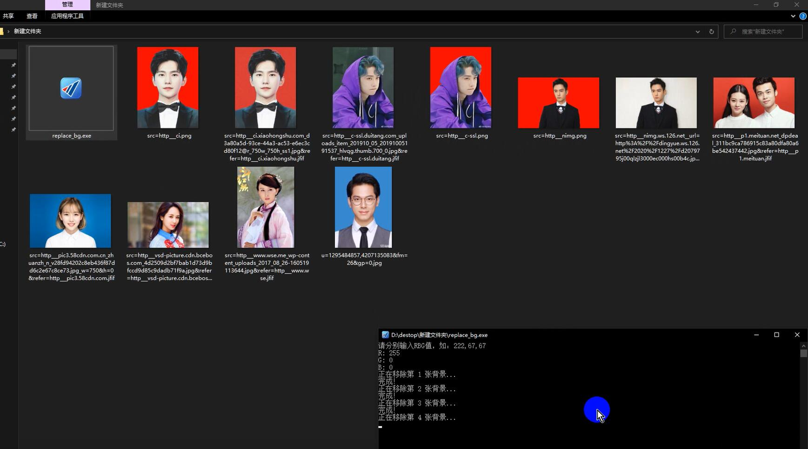

# Python图片背景替换工具

一个基于Python的快速替换人像图片背景的工具，使用百度AI开放平台的人像分割API。

## 功能特点

- 自动识别并分割人像
- 支持批量处理多张图片
- 可自定义背景颜色（RGB值）
- 保持原图分辨率

## 使用方法

1. 获取程序、
   - 运行Python源代码`replace_bg.py`

2. 使用步骤
   - 创建一个新文件夹
   - 将`replace_bg.exe`和需要处理的图片放在同一文件夹内
   - 运行`replace_bg.exe`
   - 按提示输入想要的背景色RGB值
     - 例如：红色背景输入：255, 0, 0
     - 白色背景输入：255, 255, 255

## 效果展示

处理前后对比：

## 注意事项

- 支持的图片格式：jpg、jpeg、png
- 输出格式统一为png
- RGB值范围：0-255的整数
- 需要联网使用（依赖百度AI API）